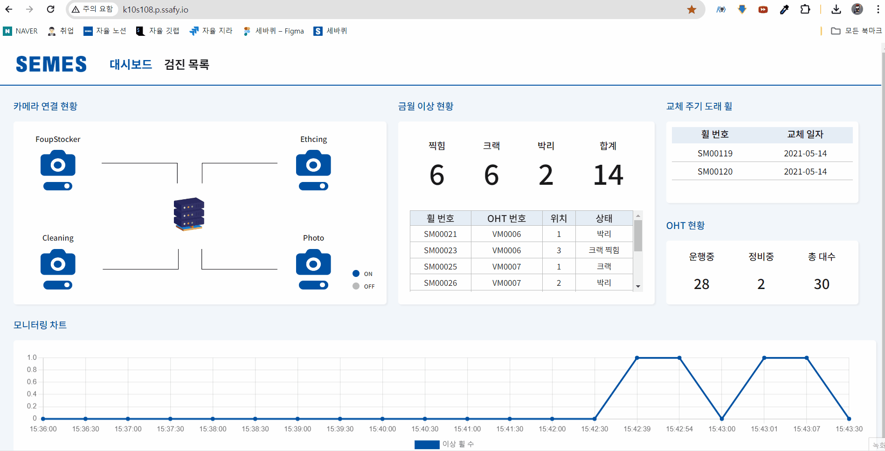
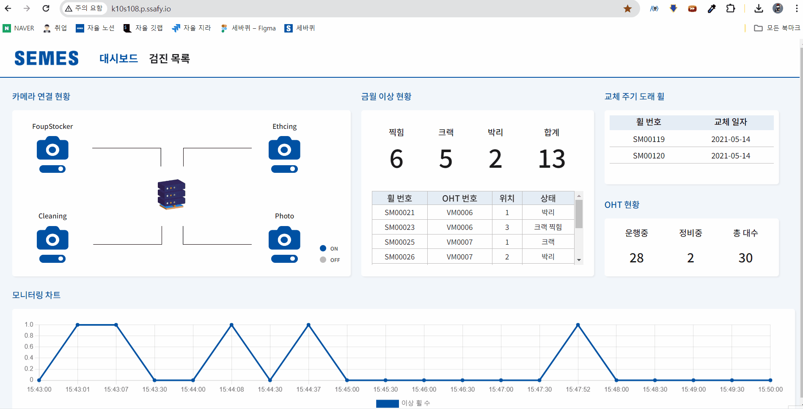
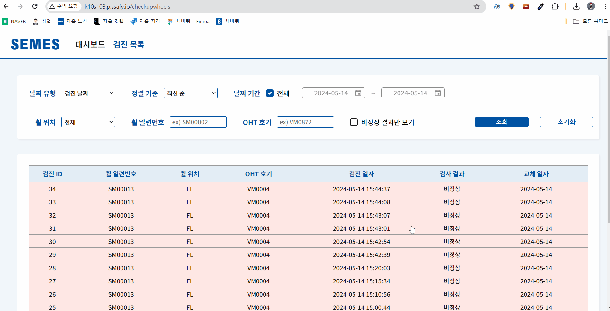
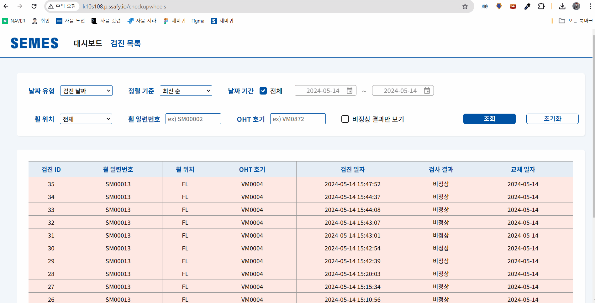
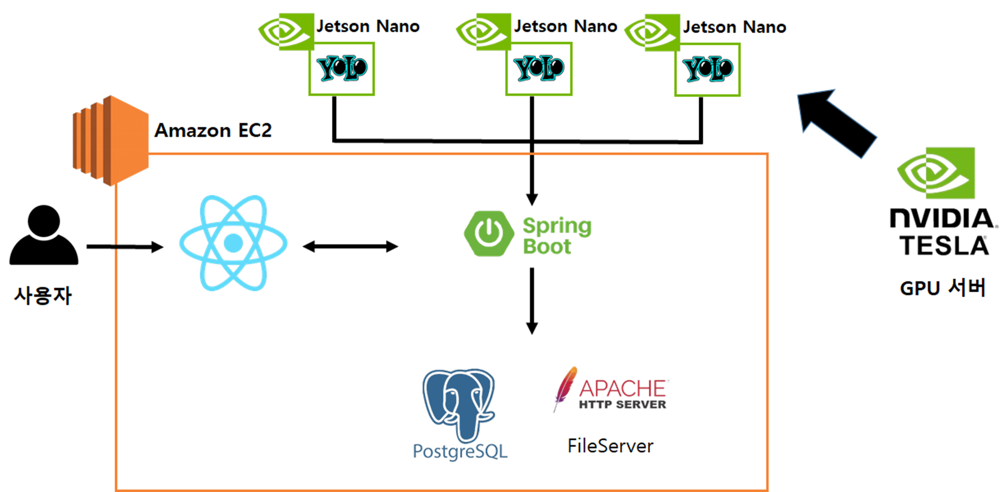

# 세바퀴 : OHT 휠 이상 감지 진단 AI

## 세바퀴 서비스 개요

- 반도체 공정에서 OHT는 공정 사이에 웨이퍼를 운반하는 역할을 하고 있습니다.
  하지만 운반하면서 OHT휠은 최대 5m/s의 빠른 속도, 115kg 가량의 무거운 하중, 3-4년 장기 사용 등의 요소로 인해 마모, 크랙 등 이상 휠이 발생 할 수 있습니다.
  현재 세메스에서는 이상 검진을 육안으로 진행하고 있는데 이러한 육안 검진은 비효율적이기 때문에 
  ai를 이용해 이미지 처리를 하는 세바퀴 서비스를 개발하게 되었습니다.  

### 프로젝트 기간

- 2024.04.08 - 2023.05.20

### 팀원 소개

|  이름  |        역할        | 담당업무                                                                                                                                      |
| :----: | :----------------: | :-------------------------------------------------------------------------------------------------------------------------------------------- |
| 오지훈 |  팀장, Front-End   | UI/UX 디자인/ front 기초 세팅 및 폴더 구조 생성, 공용 컴포넌트 제작, MainHeader, 검진 목록 페이지 - PageNation, filter 검색, AI 데이터 라벨링 |
| 전재우 |         AI         | AI 총괄, 시스템 HW 환경 구성, 데이터셋 구축, 데이터 라벨링, 모델 학습, 지름 측정 알고리즘                          |
| 신성현 | Infra, Jetson Nano | CICD,  JetsonNano 실시간 객체인식, MQTT모듈통신(jetson <-> spring),  특징점 알림Webhook,, 데이터라벨링, 모델학습                                                                               |
| 유지원 |     Front-End      | UI/UX 디자인, 공용 컴포넌트 제작, 대시보드 페이지 - chartjs 이용한 실시간 그래프       |
| 이진성 |      Back-End      | API 개발 및 유지보수, 데이터베이스 관리, SSE 엔드포인트 구현, AI 데이터 라벨링                                                                                                                          |
| 이호성 |  Front-End, Unity  | unity 시뮬레이터 제작, front 바퀴 상세페이지, three js 적용, 데이터 라벨링, 모델학습                                                          |

<hr>

## 주요 기능 소개

1. 메인 화면
<table width="100%" border-style="non" cellspacing="0" cellpadding="100">
  <tr>
    <td align="center"></td>
    <td align="center"></td>
  </tr>

</table>

2. 검진 목록
<table width="100%" border-style="non" cellspacing="0" cellpadding="100">
  <tr>
    <td align="center"></td>
    <td align="center"></td>
  </tr>
</table>

3. 뭘써야함?
<table width="100%" border-style="non" cellspacing="0" cellpadding="100">
  <tr>
    <td align="center"></td>
    <td align="center"></td>
  </tr>
</table>

4. Unity 시뮬레이터
<table width="100%" border-style="non" cellspacing="0" cellpadding="100">
  <tr>
    <td align="center"></td>
    <td align="center"></td>
  </tr>
</table>


<hr>

## 시스템 아키텍처



<hr>

## ERD


<hr>


# 🗂 프로젝트 파일 구조

### Backend

```markdown
backend
|-- 📂checkupList
|   |-- 📂controller
|   |-- 📂domain
|   |-- 📂dto
|   └-- 📂service
|-- 📂oht
|-- 📂sse
|-- 📂wheel
|
|-- 📂mqtt
|   └-- 📂dto
|-- 📂upload
|   |-- 📂controller
|   └-- 📂dtoservice
|
└-- 📂util
    |-- 📂config
    |-- 📂dto
    |-- 📂exception
```

### FrontEnd

```markdown
frontend
|-- 📂components
|   └-- 📂BaseButton
|   └-- 📂Camera
|   └-- 📂Card
|   └-- 📂CheckBox
|   └-- 📂DatePicker
|   └-- 📂DropDownFilter
|   └-- 📂FilterInput
|   └-- 📂MainHeader
|   └-- 📂Modal
|       └-- 📂Subs
|   └-- 📂Pagenation
|   └-- 📂Wheel3D 
|       └-- 📂Wheel
|       └-- 📂WheelSet
|
|-- 📂pages
|   └-- 📂CheckUpWheels
|       └-- 📂FilterSection
|       └-- 📂TableSection
|   └-- 📂Dashboard
|       └-- 📂AbnormalStatusSection
|       └-- 📂CameraConnectSection
|       └-- 📂MonitoringChartSection
|       └-- 📂OHTStateSection
|       └-- 📂ReplaceSection
|   
└-- 📂styles
|   └-- 📂colors
|   └-- 📂fonts
|
└-- 📂types
|   └-- 📂components
|       └-- 📂BaseButton
|       └-- 📂Card
|       └-- 📂CheckBox
|       └-- 📂DatePicker
|       └-- 📂DropDownFilter
|       └-- 📂FilterInput
|       └-- 📂Modal
|       └-- 📂Pagenation
|       └-- 📂Wheel3D 
|    └--📂pages
|       └-- 📂CheckUpWheels
|           └-- 📂FilterSection
|           └-- 📂TableSection
|       └-- 📂Dashboard
|           └-- 📂AbnormalStatusSection
|           └-- 📂CameraConnectSection
|           └-- 📂MonitoringChartSection
|           └-- 📂OHTStateSection
|           └-- 📂ReplaceSection

```

<br>
<br>


# 🛠 주요 기술

**Backend**
<br>

&nbsp;&nbsp;&nbsp;&nbsp;

- Java : OpenJDK 17.0.10
- SpringBoot 3.2.5
- Spring Data Jpa 3.2.5
- Gradle 8.7
- PostgreSQL 운영서버 : 15.6 개발서버 : 15.6

<br>

**FrontEnd**
<br>


- React 18.2.0
- Node.js 20.11.0
- TypeScript 4.9.5
- Styled-component 6.1.8
- Axios 1.3.5
- three 0.164.1

<br>

**CI/CD**
<br>


- nginx version: nginx/1.25.5
- jenkins 2.440.3
- Docker version 26.1.0

<br>

**Jenson Nano & AI**

<br>


- JetPack 4.6.1
- python3.6
- yolov5 v7.0
- pytorch 1.8.0
- torchvision 0.9.0


<br>

**협업 툴**
<br>


- 형상 관리 : Git
- 이슈 관리 : Jira
- 커뮤니케이션 : Mattermost, Webex, Notion
- 디자인 : Figma

<br>
