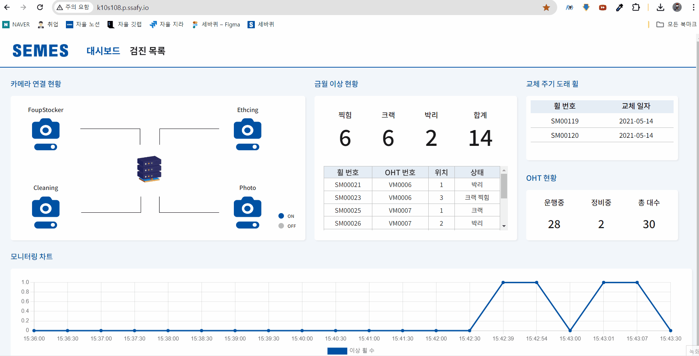
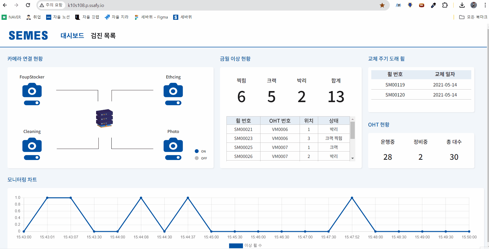

# 세바퀴 : OHT 휠 이상 감지 진단 AI

## 세바퀴 서비스 개요

- 배경 정리해서 쓰기 

### 프로젝트 기간
- 2024.04.08 - 2023.05.20

### 팀원 소개
|이름|역할|담당업무|
|:---:|:---:|:---|
|오지훈|팀장, Front-End| UI/UX 디자인/ front 기초 세팅 및 폴더 구조 생성, 공용 컴포넌트 제작, MainHeader, 검진 목록 페이지 - PageNation, filter 검색, AI 데이터 라벨링 |
|전재우|AI| 굳굳|
|신성현|Infra, Jetson Nano| 굳굳|
|유지원|Front-End| 굳굳|
|이진성|Back-End| 굳굳|
|이호성|Front-End, Unity| unity 시뮬레이터 제작, front 바퀴 상세페이지, three js, 데이터 라벨링, 모델학습|

## 주요 기능 소개

1. 메인 화면
<table width="100%" border-style="non" cellspacing="0" cellpadding="100">
  <tr>
    <td align="center"></td>
    <td align="center"></td>
  </tr>

</table>

2. Unity 시뮬레이터
<table width="100%" border-style="non" cellspacing="0" cellpadding="100">
  <tr>
    <td align="center"></td>
    <td align="center"></td>
  </tr>
</table>

  
- 세바퀴 페이지 보여주기

## 시스템 아키텍처

## ERD

# 🛠 주요 기술

**Backend**
 

&nbsp;&nbsp;&nbsp;&nbsp;&nbsp;&nbsp;
- Java : Oracle OpenJDK 11.0.17
- SpringBoot 2.7.9
- Spring Security 5.7.7
- Spring Data Jpa 2.7.9
- Spring Boot Actuator
- Junit 5.8.2
- Gradle 7.6.1
- FastAPI
- MySQL 운영서버 : 8.0.28, 개발서버 : 8.0.32

 

**FrontEnd**
 

&nbsp;&nbsp;&nbsp;&nbsp;&nbsp;

- React 18.2.0
- Node.js 20.11.0
- TypeScript 4.9.5
- Styled-component 6.1.8
- Axios 1.3.5
- three 0.164.1

 

**CI/CD**
 

&nbsp;&nbsp;&nbsp;&nbsp;&nbsp;&nbsp;&nbsp;&nbsp;&nbsp;

- AWS EC2
- Ubuntu 20.04 LTS
- Jenkins 2.387.1
- Docker Engine 23.0.1
- Nginx 1.23.4
- SSL
- SonarQube 
- Grafana latest
- Prometheus 2.44.0
- Ngrinder-controller 3.5.8
- Ngrinder-agent 3.5.8

 

**협업 툴**
 

&nbsp;&nbsp;&nbsp;&nbsp;&nbsp;
- 형상 관리 : Git
- 이슈 관리 : Jira
- 커뮤니케이션 : Mattermost, Webex, Notion
- 디자인 : Figma

 
